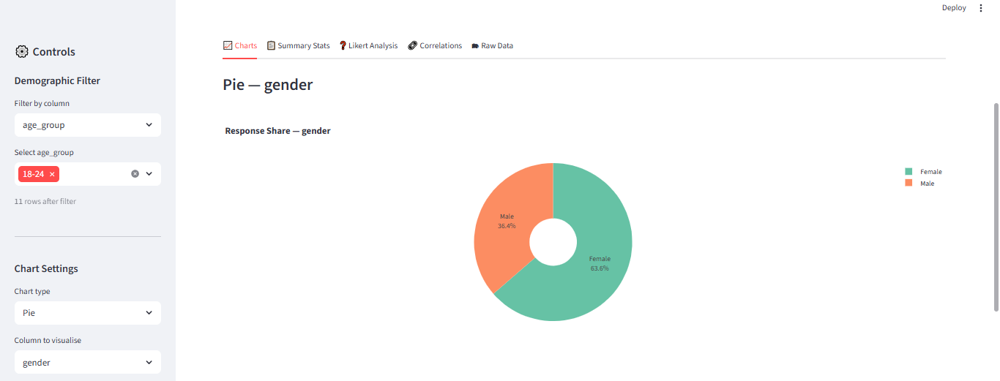
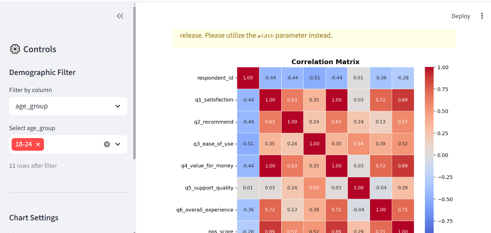
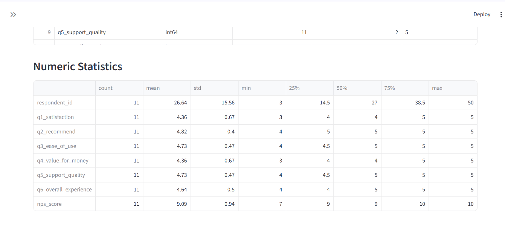

# Survey Data Visualizer

A Python Streamlit app to upload any survey dataset and instantly explore it with
interactive charts, filters, and a downloadable summary.
Built with Python, Plotly, Seaborn, and Streamlit.


---

## Screenshot




---

## What It Does

- Uploads CSV or Excel survey files via drag-and-drop
- Auto-detects numeric and categorical columns
- Renders response distribution charts - bar, pie, histogram, box plot
- Filters by demographic columns such as age group, gender, or region
- Calculates response rates, averages, and Likert scale summaries
- Exports filtered results as a new CSV file

---

## Install and Run

```bash
git clone https://github.com/BrightNodeAI/survey-visualizer.git
cd survey-visualizer
pip install streamlit plotly pandas seaborn openpyxl
streamlit run dashboard.py
```

The app opens automatically at http://localhost:8501

---

## Usage

1. Run the app with: streamlit run dashboard.py
2. Upload your survey CSV or Excel file
3. Use the sidebar to select chart type and columns
4. Apply demographic filters to segment responses
5. Download the filtered data using the export button

---

## Project Structure

```
survey-visualizer/
    dashboard.py            - Main Streamlit app
    charts.py               - Plotly and Seaborn chart functions
    processor.py            - Data cleaning and column detection
    sample_data/
        sample_survey.csv   - Example survey dataset (50 responses)
    requirements.txt
    screenshot.png
    README.md
```

---

## Sample Input Format

```
respondent_id, age_group, gender, region, q1_satisfaction, q2_recommend, q3_ease_of_use
1, 25-34, Female, North, 4, 5, 3
2, 35-44, Male, South, 3, 4, 4
```

Any CSV with at least 2 columns works - the app adapts automatically.

---

## Requirements

```
streamlit>=1.30.0
plotly>=5.0.0
pandas>=1.5.0
seaborn>=0.12.0
openpyxl>=3.1.0
```

---

## Deploy Free on Streamlit Cloud

1. Push this repo to your GitHub account
2. Go to share.streamlit.io
3. Connect your repo and select dashboard.py
4. Your live URL is ready in 2 minutes - share it directly with clients

---

## Skills Demonstrated

Python, Streamlit, Plotly, Seaborn, Pandas, data visualisation, interactive dashboards, survey analysis, Likert scale, cloud deployment

---

## Freelance Applications

- HR pulse survey analysis for companies
- Customer satisfaction (CSAT and NPS) reporting
- Academic research data visualisation
- Market research results presentation

---

Built by [BrightNode AI](https://www.freelancer.pk/u/BrightNodeAI) - Python Data Science and AI specialists
